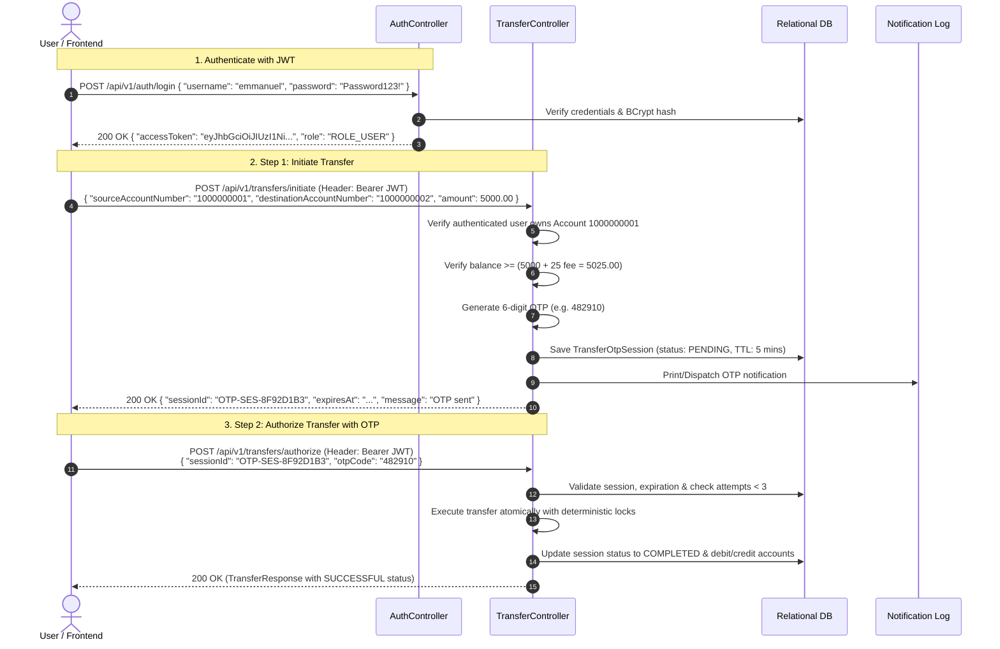

# DotLabs - Money Transfer Service

[](https://www.oracle.com/java/)
[](https://spring.io/projects/spring-boot)
[](https://spring.io/projects/spring-security)
[](https://jwt.io/)
[]()
[](https://kubernetes.io/)

A production-grade Java Spring Boot microservice designed to simulate secure money transfers between bank accounts with **Spring Security & Stateless JWT Authentication**, **Two-Factor OTP (1-Time Password) Step-Up Transfer Authorization**, automated transaction fee calculation, scheduled commission evaluation, daily aggregation reporting, and distributed concurrency protection tailored for Kubernetes multi-instance environments.

---

## 📋 Table of Contents
1. [Key Features](#-key-features)
2. [Architecture & Design Patterns](#-architecture--design-patterns)
3. [Business Rules & Formulas](#-business-rules--formulas)
4. [Security, JWT & Two-Factor OTP Workflow](#-security-jwt--two-factor-otp-workflow)
5. [Kubernetes Multi-Pod & Concurrency Strategy](#-kubernetes-multi-pod--concurrency-strategy)
6. [Getting Started & Running Locally](#-getting-started--running-locally)
7. [API Documentation & cURL Examples](#-api-documentation--curl-examples)
8. [Running with Docker & Kubernetes](#-running-with-docker--kubernetes)
9. [Automated Testing & Concurrency Verification](#-automated-testing--concurrency-verification)
10. [Pre-seeded Test Users & Accounts](#-pre-seeded-test-users--accounts)

---

## 🚀 Key Features

* **JWT Authentication & Registration (`/api/v1/auth`)**:
  - Stateless JSON Web Token authentication signed with HMAC-SHA256.
  - User registration with auto-assigned 10-digit bank account numbers and welcome balance.
  - Role-based authorization (`ROLE_USER`, `ROLE_ADMIN`).
  - Pre-seeded test credentials ready to test.

* **Two-Factor OTP Step-Up Money Transfer (`POST /api/v1/transfers/initiate` & `/authorize`)**:
  - Step 1 (`/initiate`): Validates funds, generates a cryptographic 6-digit OTP (5-minute TTL), dispatches notification, and returns a transfer session ID.
  - Step 2 (`/authorize`): Verifies OTP against the session ID with anti-brute-force rate limiting (maximum 3 failed attempts) and executes the transfer atomically.
  - Direct transfers (`POST /api/v1/transfers`) also supported for authenticated clients.
  - Enforces account ownership: Users can only move funds from accounts they own.

* **Money Transfer Processing & Fee Calculation**:
  - Automatic transaction fee calculation (**0.5% capped at 100.00**).
  - Total billed amount computed as `amount + transactionFee`.
  - Atomicity, balance checks, and status tracking (`SUCCESSFUL`, `INSUFFICIENT FUND`, `FAILED`, `ACCOUNT_NOT_FOUND`).

* **Dynamic Transaction Querying (`GET /api/v1/transactions`)**:
  - Filter transactions by `status`, `accountNumber` (sender or recipient), and date range (`startDate`, `endDate`).
  - Full pagination and sorting support using Spring Data JPA Specifications (Criteria API).

* **Scheduled Commission Analysis Job (`POST /api/v1/commissions/run-analysis` & Cron)**:
  - Daily scheduled operation (default: `01:00 AM`) analyzing successful transactions.
  - Updates transactions as `commissionWorthy = true` with commission calculated at **20% of the transaction fee** (capped at 20.00).
  - Multi-instance distributed locking via **ShedLock**.

* **Daily Transaction Summary (`GET /api/v1/summaries/daily` & Cron)**:
  - Generates aggregate metrics (total transactions, volume, fees, commission, status breakdown) for any specified date (present and past).
  - Daily scheduled archiving job (default: `02:00 AM`) with ShedLock.

* **Production Readiness**:
  - **SpringDoc OpenAPI / Swagger UI** with interactive JWT Bearer authentication.
  - **Spring Boot Actuator** health probes (`/actuator/health/liveness`, `/actuator/health/readiness`, `/actuator/metrics`, `/actuator/prometheus`).
  - Multi-stage **Dockerfile**, **docker-compose.yml**, and **Kubernetes manifests** (`k8s/`).

---

## 🏛️ Architecture & Design Patterns

The service adheres strictly to clean architecture and enterprise patterns:
* **Layered Architecture**: Clear separation of concerns:
  - `controller`: REST APIs, OpenAPI docs, input validation (`@Valid`).
  - `service`: Service interfaces and `service.impl` package implementations for business logic.
  - `security`: `JwtAuthenticationFilter`, `JwtTokenProvider`, `CustomUserDetailsService`, `SecurityConfig`, `AccountOwnershipValidator`.
  - `repository`: Spring Data JPA with `JpaSpecificationExecutor` for dynamic queries and `@Lock(LockModeType.PESSIMISTIC_WRITE)` for concurrency isolation.
  - `entity` / `dto`: Encapsulated domain entities and immutable DTO records.
  - `scheduler`: ShedLock-guarded cron workers.
  - `exception`: Centralized `@RestControllerAdvice` exception handler.
* **Database Versioning (Flyway)**:
  - `V1__init_schema.sql`: Automated schema creation for accounts, transactions, daily summaries, and ShedLock.
  - `V2__seed_initial_accounts.sql`: Pre-loaded test accounts and balances.
  - `V3__security_users_and_otp.sql`: Users table, OTP transfer sessions, and pre-seeded login credentials.
* **Design Patterns Employed**:
  - **Unified Response Envelope Pattern**: `ApiResponse<T>` providing consistent REST payloads.
  - **Strategy & Utility Pattern**: `FeeCalculator` encapsulating financial rounding and capping rules.
  - **Specification Pattern**: `TransactionSpecification` constructing dynamic JPA Criteria predicates.
  - **Builder Pattern**: Fluent entity and DTO instantiation.
  - **Distributed Lock Pattern**: ShedLock JDBC Provider ensuring single-leader job execution across Kubernetes pods.

---

## 📐 Business Rules & Formulas

### 1. Transaction Fee
$$\text{Fee} = \min(\text{Amount} \times 0.005, 100.00)$$
* Fee is **0.5%** of the transfer principal amount.
* Maximum fee cap is **100.00**.
* Total amount debited from sender: $\text{Billed Amount} = \text{Amount} + \text{Fee}$.

### 2. Commission
$$\text{Commission} = \text{Transaction Fee} \times 0.20$$
* Commission is **20%** of the collected transaction fee.
* Maximum commission per transaction is **20.00** ($100.00 \times 20\%$).
* Non-successful transactions (e.g. `INSUFFICIENT FUND`) have `commissionWorthy = false` and `commission = 0.00`.

---

## 🔐 Security, JWT & Two-Factor OTP Workflow



---

## 🛡️ Kubernetes Multi-Pod & Concurrency Strategy

The assessment explicitly notes: *"We run multiple instances of our services in a kubernetes cluster."*

To ensure full resilience in a multi-pod cluster:

1. **Deadlock Prevention in Balance Transfers**:
   - When transferring between Account A and Account B, accounts are locked in a deterministic order based on account numbers (`source.compareTo(dest) < 0 ? lock source then dest : lock dest then source`).
   - This eliminates circular wait deadlocks when Account A transfers to Account B at the exact same moment Account B transfers to Account A.

2. **Distributed Scheduled Tasks (ShedLock)**:
   - When 5 replicas of the service run in Kubernetes, both the Commission Analysis job and Daily Summary job use `@SchedulerLock` backed by the SQL `shedlock` table.
   - Only a single pod acquires the execution lock; other pods safely skip execution.

3. **Kubernetes Health & Autoscaling**:
   - `livenessProbe` and `readinessProbe` wired to Spring Boot Actuator endpoints.
   - `k8s/hpa.yaml` configured to autoscale pods between 2 and 10 replicas based on CPU/memory utilization.

---

## 💻 Getting Started & Running Locally

### Prerequisites
* Java 17+ installed (`java -version`)
* Maven is **not required** (the project includes the Maven wrapper `./mvnw` / `mvnw.cmd`)

### Clone & Run
```bash
# Navigate to the project directory
cd dotlabs-money-transfer

# Run the application with Maven wrapper
./mvnw spring-boot:run        # On Linux / macOS
.\mvnw.cmd spring-boot:run    # On Windows
```

The application starts on `http://localhost:8080`.

### Interactive Swagger UI with JWT Bearer Auth
Open your browser and navigate to:
👉 **`http://localhost:8080/swagger-ui.html`**

Click the green **"Authorize"** button in the top right, paste your JWT token obtained from `/api/v1/auth/login`, and test any protected endpoint directly!

---

## 📡 API Documentation & cURL Examples

### 1. Authentication (`POST /api/v1/auth/login`)
```bash
curl -X POST http://localhost:8080/api/v1/auth/login \
  -H "Content-Type: application/json" \
  -d '{
    "username": "emmanuel",
    "password": "Password123!"
  }'
```
**Response (200 OK):**
```json
{
  "success": true,
  "message": "Login successful",
  "data": {
    "accessToken": "eyJhbGciOiJIUzI1NiIsInR5cCI6IkpXVCJ9...",
    "tokenType": "Bearer",
    "username": "emmanuel",
    "role": "ROLE_USER",
    "accountNumber": "1000000001",
    "expiresInMs": 86400000
  },
  "timestamp": "2026-09-01T13:30:00"
}
```

---

### 2. Step 1: Initiate 2FA Transfer (`POST /api/v1/transfers/initiate`)
```bash
curl -X POST http://localhost:8080/api/v1/transfers/initiate \
  -H "Content-Type: application/json" \
  -H "Authorization: Bearer <YOUR_JWT_TOKEN>" \
  -d '{
    "sourceAccountNumber": "1000000001",
    "destinationAccountNumber": "1000000002",
    "amount": 5000.00,
    "description": "Consulting invoice #104"
  }'
```
**Response (200 OK):**
```json
{
  "success": true,
  "message": "OTP has been sent to your registered channel. Please authorize the transfer within 5 minutes.",
  "data": {
    "sessionId": "OTP-SES-8F92D1B34A5C",
    "sourceAccountNumber": "1000000001",
    "destinationAccountNumber": "1000000002",
    "amount": 5000.00,
    "transactionFee": 25.00,
    "billedAmount": 5025.00,
    "expiresAt": "2026-09-01T13:35:00"
  },
  "timestamp": "2026-09-01T13:30:00"
}
```
*(Check the application console logs for the simulated OTP dispatch banner).*

---

### 3. Step 2: Authorize Transfer with OTP (`POST /api/v1/transfers/authorize`)
```bash
curl -X POST http://localhost:8080/api/v1/transfers/authorize \
  -H "Content-Type: application/json" \
  -H "Authorization: Bearer <YOUR_JWT_TOKEN>" \
  -d '{
    "sessionId": "OTP-SES-8F92D1B34A5C",
    "otpCode": "482910"
  }'
```
**Response (200 OK):**
```json
{
  "success": true,
  "message": "Transfer completed successfully",
  "data": {
    "transactionReference": "TX-9E4D67250DEA",
    "sourceAccountNumber": "1000000001",
    "destinationAccountNumber": "1000000002",
    "amount": 5000.00,
    "transactionFee": 25.00,
    "billedAmount": 5025.00,
    "status": "SUCCESSFUL",
    "statusMessage": "Transfer completed successfully",
    "description": "Consulting invoice #104",
    "dateCreated": "2026-09-01T13:31:00"
  },
  "timestamp": "2026-09-01T13:31:00.123"
}
```

---

### 4. Direct Transfer (`POST /api/v1/transfers`)
```bash
curl -X POST http://localhost:8080/api/v1/transfers \
  -H "Content-Type: application/json" \
  -H "Authorization: Bearer <YOUR_JWT_TOKEN>" \
  -d '{
    "sourceAccountNumber": "1000000001",
    "destinationAccountNumber": "1000000002",
    "amount": 2000.00,
    "description": "Direct lunch transfer"
  }'
```

---

### 5. Retrieve Transactions with Filters (`GET /api/v1/transactions`)
```bash
# Filter by status and account number with pagination
curl -X GET "http://localhost:8080/api/v1/transactions?status=SUCCESSFUL&accountNumber=1000000001&page=0&size=10"

# Filter by date range
curl -X GET "http://localhost:8080/api/v1/transactions?startDate=2026-08-01&endDate=2026-09-30"

# Get single transaction by reference
curl -X GET "http://localhost:8080/api/v1/transactions/TX-9E4D67250DEA"
```

---

### 6. Trigger Commission Analysis (`POST /api/v1/commissions/run-analysis`)
```bash
curl -X POST http://localhost:8080/api/v1/commissions/run-analysis \
  -H "Authorization: Bearer <YOUR_JWT_TOKEN>"
```

---

### 7. Daily Transaction Summary (`GET /api/v1/summaries/daily`)
```bash
# Summary for today
curl -X GET http://localhost:8080/api/v1/summaries/daily

# Summary for a specific past date
curl -X GET "http://localhost:8080/api/v1/summaries/daily?date=2026-08-28"
```

---

## 🐳 Running with Docker & Kubernetes

### Docker Compose (App + PostgreSQL)
```bash
docker-compose up --build
```

### Deploying to Kubernetes
```bash
# Apply ConfigMap, Secret, Deployment, Service, and HPA
kubectl apply -f k8s/configmap.yaml
kubectl apply -f k8s/deployment.yaml
kubectl apply -f k8s/service.yaml
kubectl apply -f k8s/hpa.yaml
```

---

## 🧪 Automated Testing & Concurrency Verification

Run all 36 test suites via Maven wrapper:
```bash
./mvnw clean test        # Linux / macOS
.\mvnw.cmd clean test    # Windows
```

### Test Coverage Highlights:
* **`JwtTokenProviderTest` & `AuthServiceTest`**: Validates JWT token generation, signature validation, expiry, login, and registration.
* **`OtpServiceTest`**: Tests 6-digit OTP generation, expiration TTL, session locking after 3 failed attempts, and verification.
* **`TransferOtpIntegrationTest`**: Full end-to-end integration test verifying the complete 2FA flow (Login $\rightarrow$ Initiate $\rightarrow$ Authorize with OTP $\rightarrow$ Mutate balances).
* **`ConcurrentTransferIntegrationTest`**: Multithreaded integration test executing 20 simultaneous bidirectional transfers across threads to verify zero deadlocks and 100% balance conservation.
* **`FeeCalculatorTest`**: Validates 0.5% fee computation, 100.00 cap boundary, and 20% commission derivation.
* **`CommissionServiceTest` & `SummaryServiceTest`**: Tests batch evaluation of successful transactions and multi-status metrics aggregation.

---

## 🏦 Pre-seeded Test Users & Accounts

The application automatically seeds test users and accounts on startup via Flyway:

| Username | Password | Role | Assigned Account Number | Account Holder Name | Initial Balance (NGN) |
|---|---|---|---|---|---|
| `emmanuel` | `Password123!` | `ROLE_USER` | `1000000001` | Emmanuel Ugwueze | ₦500,000.00 |
| `ekene` | `Password123!` | `ROLE_USER` | `1000000002` | Ekene iloezumma | ₦250,000.00 |
| `ikemefuna` | `Password123!` | `ROLE_USER` | `1000000003` | Ikemefuna Nwodo | ₦50.00 |
| `admin` | `Password123!` | `ROLE_ADMIN` | `1000000004` | DotLabs Treasury | ₦10,000,000.00 |
